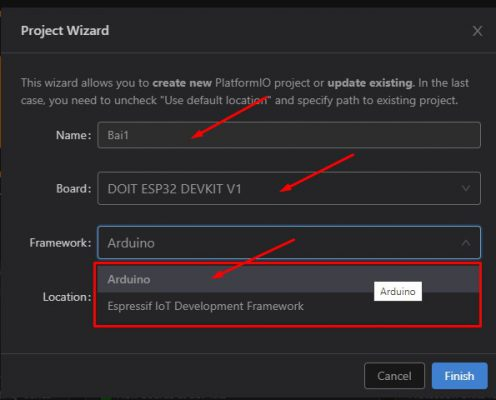

# Tổng quan dự án mạng cảm biến không dây sử dụng công nghệ Lora  


-- Dự án này nhằm tạo ra một mạng cảm biến không dây có dùng để đo và quản lý nhiệt độ, hiển thị nhiệt độ đo được và xuất file Excel để lưu trữ.  

Đáp ứng các yêu cầu:  
- Dải đo: 25 ÷ $125^o$C   
- Độ chính xác: $1^o$C   
- Độ phân giải hiển thị: $0.1^o$C  
- Nguồn pin, thời gian hoạt động của thiết bị là 4h (nâng cao: 8h). Pin có thể sạc trực tiếp trên máy hoặc tháo ra ngoài  
- Kích thước (dự kiến): 70x50x100mm (kiểu trụ để dễ cầm tay).    
- Trọng lượng (dự kiến): <150g.   
- Thời gian đo một mẫu : <20s (nâng cao < 5s).  
- Kết nối máy tính: RF  Khoảng cách truyền trong phạm vi 20m từ hệ thống đo đến trạm thu RF có nối nguồn và mạng.     
Quản lý tối thiểu cho 10 thiết bị đo. (nâng cao: phương án mở rộng số thiết bị với khoảng cách từ thiết bị đến trạm tiếp nhận có thể lên tới 100m)  
- Phần mềm máy tính: thu thập giá trị đo từ thiết bị đo, quản lý dữ liệu, xuất báo cáo dạng excel, giao diện theo mẫu thống nhất.  
- Có nút bấm bắt đầu đo; Đèn LED báo ngưỡng nhiệt độ (3 LED).  
- OTA (nâng cao): Các ngưỡng nhiệt độ có thể cập nhật từ máy tính. 
---
---  
# I. Cài đặt và sử dụng phầm mềm
## 1. Platform IO lập trình ESP32
**Ứng dụng trong dự án:** Lập trình vi điều khiển ESP32 cho End Devices và Gateway.

[Link hướng dẫn chi tiết](https://khuenguyencreator.com/huong-dan-cai-dat-platform-io-lap-trinh-esp32/)
## Cài đặt Visual Studio Code (VS Code)
Truy cập link: https://code.visualstudio.com/
-- Download và Cài đặt như một software bình thường.
## Cài đặt Platform IO
-- Trước khi cài Extension này, cần cài đặt Python cho máy tính đã.


Truy cập link: https://www.python.org/downloads/.  
**Lưu ý**: Hãy tích chọn Add Python 3.8 to PATH để có thể run Python ở bất cứ đâu.  
-- Sau đó mở VS code, chuyển đến tab Extension, trong ô tìm kiếm gõ    **Platformio IDE**.
-- Nhấn cài đặt, sau khi cài đặt xong sẽ hiển thị như hình:

  
-- Restart lại VS code sau đó chờ cho tất cả các extension được load.
**Lưu ý:** máy tính cần phải có mạng nhé.
## Cài đặt Driver nạp cho mạch.
-- Tùy vào trường hợp mạch sử dụng IC UART nào, sẽ cài đặt driver cho chip đó:
Thường là 2 loại:  
CP210x: [Link download và cài đặt](https://sparks.gogo.co.nz/ch340.html).  
CH340:  [Link download và cài đặt](https://sparks.gogo.co.nz/ch340.html).  
## Hướng dẫn sử dụng Platform IO lập trình ESP32
-- Tạo một dự án lập trình ESP32 với Platform IO. Nhấn vào biểu tượng logo của Platform io, trong tab Quick Acccess nhấn Open. Vs code sẽ mở ra trang PIO Home.  
-- Sau đó nhấn vào New Project để tạo 1 dự án mới. Đặt tên dự án, Chọn KIT sử dụng, ở đây là board DOIT ESP32 DEV KIT (loại thường gặp nhất đó).  
Chọn Framwork là Arduino:



-- Bỏ tick Use Defaul Location, sau đó trỏ tới nơi lưu project, nhấn Finish để hoàn thành.  

  

-- Sau khi project được tạo, giao diện như sau:  


**Gồm :**
- **Phần cây thư mục dự án:** cho phép thêm, sửa, xóa các file nhanh  
- **Phần Text editor:** là nơi viết code  
- **Cửa sổ Terminal:** Nơi gõ các câu lênh  
- **Thanh công cụ:** Lần lượt là Home, Build, Upload code, Clean, Serial Monitor(màn hình serial), Terminal  
- **Thư mục Src:** Chứa Source code của chương trình, đây là nơi lưu trữ code và sẽ code trên đó. File thực thi chính là: main.cpp  
- **Ứng dụng trong dự án:** Lập trình vi điều khiển ESP32 cho End Devices và Gateway

-- Trên thực tế, có thể Copy trực tiếp các đoạn code viết bằng Arduino IDE và Paste thẳng vào đây. Chỉ cần giữ **#include <Arduino.h>** là code cũng có thể chạy bình thường. Thế nên các dự án viết bằng Arduino cũng đều có thể viết bằng VS code nhé.   
-- File platformio.ini là file cấu hình PlatformIO cho project. Nó hiển thị các thông tin như platform, board và framework được sử dụng. Cũng có thể thêm các cấu hình khác như các thư viện được đưa vào, tùy chọn upload code, hay tốc độ truyền của Serial Monitor, đường dẫn thư viện và các cấu hình khác. Thực tế nên để nguyên.  
-- Nếu muốn thay đổi tốc độ baud của Serial Monitor có thể sử dụng lệnh: **monitor_speed = 115200**.  
-- Nếu muốn thêm đường dẫn của thư viện, dùng: lib_deps = E:/thuvien. Trong đó E:/thuvien là đường dẫn tới file thư viện cần cài đặt.    
## Cài đặt thư viện cho Platformio   
### Sử dụng công cụ Libraly trong Platformio  
- Làm theo quy trình dưới đây nếu cần cài đặt thư viện trong PlatformIO IDE.  
- Nhấp vào biểu tượng Home để chuyển đến Trang chủ PlatformIO. Nhấp vào biểu tượng Libraries trên thanh bên trái.  
- Tìm kiếm thư viện muốn cài đặt.  
- Ví dụ Adafruit_BME280 .  


-- Nhấp vào thư viện muốn đưa vào dự án của mình. Sau đó, nhấp vào Add to Project.  


-- Chọn dự án muốn sử dụng thư viện.


-- Thao tác này sẽ thêm code định danh thư viện bằng cách sử dụng lid_depschỉ thị trên file platformio.ini . Nếu mở file platformio.ini của dự án , nó sẽ trông như trong hình ảnh sau.  


-- Ngoài ra, trên cửa sổ thư viện, nếu chọn tab Installation và cuộn một chút, sẽ thấy code định danh cho thư viện. Có thể chọn bất kỳ số nhận dạng nào tùy thuộc vào tùy chọn muốn sử dụng. Các mã nhận dạng thư viện được đánh dấu màu đỏ.


## Build và Upload code cho ESP32 bằng Platform IO
-- Đây là 1 example huyền thoại là Blink Led trên Arduino IDE, copy đoạn code đó, sau đó paste vào VS code.


Nhớ giữ lại **#include <Arduino.h>** nhé!


-- Sau đó nhấn Build để biên dịch chương trình, Khi terminal báo Success là ok. Nếu chương trình có lỗi, hãy chuyển tab Problems để view lỗi nhé!  
-- Cắm mạch vào và nhấn Upload, nếu đến đoạn connecting mà vscode ko tìm thấy esp, nhấn nút BOOT trên mạch giữ 1 chút rồi nhả ra nhé. Để ESP vào chế độ Nạp.


-- Sau khi nạp xong, thì xem thành quả thôi!!!  
## 3. Arduino
**Ứng dụng trong dự án:** UART để hiển thị các dữ liệu truyền nhận được giữa End Devices và Gateway, hỗ trợ mô phỏng để kiểm tra dữ liệu theo thời gian.  
[Link hướng dẫn chi tiết](https://khuenguyencreator.com/bai-1-huong-dan-cai-dat-arduino-ide-va-cach-them-thu-vien/)  
**Bước 1:** Truy cập địa chỉ này để cài đặt [Arduino IDE](https://www.arduino.cc/pro/software-arduino-pro-ide/). Đây là nơi lưu trữ cũng như cập nhật các bản IDE của Arduino. Bấm vào mục **Windows ZIP file**  như hình minh họa.  

  

Web chuyển đến một trang mời quyền góp tiền để phát triển phần mềm cho Arduino, tiếp tục bấm **JUST DOWNLOAD** để bắt đầu tải.


**Bước 2:** Sau khi download xong, bấm chuột phải vào file vừa **download arduino-1.6.4-windows.zip** và chọn **“Extract here”** để giải nén.


**Bước 3:** Copy thư mục arduino-1.6.4 vừa giải nén đến nơi lưu trữ.
**Bước 4:** Chạy file cài đặt trong thư mục arduino để cài đặt Arduino IDE và khởi động nó lên. 


Như vậy là đã cài đặt Arduino IDE xong.  

**Cài đặt Serial**
-- Cài đặt **Port** truyền nhận dữ liệu (ở đây đang dùng COM5) và tốc độ truyền ở **Upload Speed**.


Serial trên Adrunino có chế độ **Show Timestamp** để hiển thị thời gian truyền nhận đến **ms**.

  

---
---
# II. Triển khai dự án
## 1. Sơ đồ chân 
**-- Gateway**  

| Lora sx1278  | esp32  |
|:---:|:---:|
|3.3V|3.3V   |
| GND  |GND   |
| NSS|D5   |
| DIDO  |D2   |
| SCK  |D18   |
| MISO     |D19   |
| MOSI  |D23   |
| RST  |D14   |  

**-- Endnode**  

| Lora sx1278  | esp32  |
|:---:|:---:|
|3.3V|3.3V   |
| GND  |GND   |
| NSS|D5   |
| DIDO  |D2   |
| SCK  |D18   |
| MISO  |D19   |
| MOSI  |D23   |
| RST  |D14   |
| Data DS18B20 |D13   |
| Chân nút nhấn  |  D15 |
|  Led xanh |D25   |
|  Led vàng |D26   |
|  Led đỏ |D27 |  

---
## 2. Xây dựng EndNode
### 2.1 Cơ chế hoạt động  
**EndNode:** Chủ yếu ở chế độ chỉ gửi dữ liệu, thời gian thức khoảng 2s.  
-- Giữ nút 1 lúc > 1s thì vào chế độ: Nhận dữ liệu từ Gateway để cập nhật ngưỡng nhiệt độ.  
+ kiểm tra địa chỉ xem có phải gửi cho EndNode này hoặc Broadcast không, đúng mới nhận, còn không thì không nhận.
+ Khi nhận được gói tin sẽ tiến hành phân tích và cập nhật ngưỡng nhiệt mới.  
+ Dữ liệu truyền đi dạng abcdef: abc = T_Blue, def = T_Yellow  
  Giả sử nhiệt độ đo được là temp_current  
  Temp_current <= T_Blue:  bật đèn xanh  
  T_Blue < Temp_current <= T_Yellow: bật đèn vàng  
  Temp_current > T_Yellow: bật đèn đỏ  
+ Thả nút sẽ thoát khỏi chế độ nhận dữ liệu, đo và hiển thị Led xem có đúng với ngưỡng cập nhật không, rồi lại vào chế độ ngủ.   

-- Khi nhấn nút < 1s: bắt đầu đo nhiệt độ và gửi dữ liệu lên Gateway, gửi xong vào chế độ ngủ.    
+ Hiển thị Led theo ngưỡng nhiệt trong 0.5s.  
### 2.2 Deep Sleep Mode  
[Link tìm hiểu về Sleep Mode](https://khuenguyencreator.com/lap-trinh-esp32-sleep-mode-che-do-ngu-tiet-kiem-nang-luong/)  
-- Ở dự án này, bọn em sẽ chọn chế độ Sleep mạnh nhất, đó là Deep Sleep Mode.  
-- Với chế độ Deep Sleep, CPU, RAM và tất cả các ngoại vi đều bị tắt. Các bộ phận duy nhất của chip vẫn được cấp nguồn là: bộ RTC, ngoại vi RTC (bao gồm bộ ULP) và bộ nhớ RTC.  
-- CPU chính bị tắt nguồn còn bộ ULP thực hiện các phép đo cảm biến và đánh thức hệ thống chính dựa trên dữ liệu đo được.  
-- Cùng với CPU, bộ nhớ chính của chip cũng bị tắt. Vì vậy, mọi thứ được lưu trữ trong bộ nhớ đó bị xóa sạch và không thể truy cập được.  
-- Tuy nhiên, bộ nhớ RTC vẫn được bật. Vì vậy, nội dung của nó được bảo quản trong Deep Sleep và có thể được lấy ra sau khi chip được đánh thức. Đó là lý do mà chip lưu trữ dữ liệu ngưỡng nhiệt trước đó.    
-- Khi Wake up khỏi Deep Sleep, ESP32 sẽ hoạt động lại từ đầu, tương tự như việc reset vậy.  
-- Trong chế độ này ESP32 tiêu thụ từ 10µA đến 0.15mA (thấp hơn nhiều lần so với năng lượng tiêu thụ khi ở chế độ Active Mode).  


### 2.3 Một số hàm quan trọng  
a) Hàm gửi dữ liệu:  
```c
void sendMessage(byte* outgoing) {
  LoRa.beginPacket();                   // bắt đầu gói tin
  LoRa.write(destination);              // thêm địa chỉ nhận
  LoRa.write(localAddress);             // thêm địa chỉ gửi
  LoRa.write(msgCount);                 // thêm chỉ số bản tin gửi đi     
  LoRa.write(payloadLenght);            // thêm độ dài bản tin gửi đi
  LoRa.write(outgoing, payloadLenght);  // thêm bản tin
  LoRa.endPacket();                     // kết thúc gói tin và gửi đi
  msgCount++;                           // tăng chỉ số bản tin
}
```  
b) Hàm đưa Endnode vào chế độ ngủ  
```c
// Vào chế độ ngủ
  Serial.println("Going to sleep now");
  esp_deep_sleep_start();
```
c) Hàm thức giấc Endnode bằng cách nhấn nút  
```c
//Cài đặt chân 15 để làm nút nhấn
  esp_sleep_enable_ext0_wakeup(GPIO_NUM_15,1); //1 = High, 0 = Low
```
d) Hàm đưa End Node vào chế độ nhận ngưỡng nhiệt từ Gateway
```c
// Nếu vẫn đang nhấn nút thì vào chế độ nhận ngưỡng nhiệt
  while(digitalRead(btnPin) == HIGH)
  {
  Serial.println("In the case of receiving heat threshold");
	onReceive(LoRa.parsePacket()); 
  }	
```

e) Hàm nhận và cập nhật ngưỡng nhiệt cho Endnode
```c
// Hàm nhận dữ liệu để thay đổi ngưỡng nhiệt
void onReceive(int packetSize) {
  if (packetSize == 0) return;          // Nếu không có bản tin thì return
//Phân tích dữ liệu nhận được
  int recipient = LoRa.read();          // địa chỉ người nhận
  byte sender = LoRa.read();            // địa chỉ người gửi
  byte incomingMsgId = LoRa.read();     // chỉ số bản tin nhận
  byte incomingLength = LoRa.read();    // độ dài bản tin nhận

  Serial.println("Received from: 0x" + String(sender, HEX));
  Serial.println("Sent to: 0x" + String(recipient, HEX));
  Serial.println("Message ID: " + String(incomingMsgId));
  Serial.println("Message length: " + String(incomingLength));
  byte incomingData[4];
  int i=0;
  Serial.println("We are in the case of data receiving");    
  while (LoRa.available()) {
  incomingData[i] = LoRa.read();
  i++;
  }    
// Kiểm tra xem nếu gửi cho Endnode này hoặc Broadcast thì mới nhận
  if (recipient != localAddress && recipient != 0xFF) {   
    Serial.println("This message is not for me.");
    return;                             // skip rest of function
  }
// Nhận ngưỡng nhiệt
    T_Blue = ((incomingData[0] << 8) | incomingData[1]);
    T_Blue = T_Blue;
    T_Yellow = ((incomingData[2] << 8) | incomingData[3]);
    T_Yellow = T_Yellow;
    Serial.println("Blue Temperature Threshold: " + String (T_Blue));
    Serial.println("Yellow Temperature Threshold: " + String (T_Yellow));
  }
```
## 3. Xây dựng Gateway  
### 3.1 Cơ chế hoạt động  
-- Nhận dữ liêu nhiệt độ đo được từ EndNode và hiển thị lên ThingSpeak, xuất file excel
+ Kiểm tra xem dữ liệu có phải được gửi từ 10 địa chỉ Endnode đã cấp trước không, nếu đúng thì mới nhận, còn không thì không nhận  
+ Kiểm tra địa chỉ xem có phải gửi cho Gateway hoặc Broadcast không  
+ Kiểm tra xem có phải chỉ số bản tin mới không ( tránh trường hợp tấn công bản tin gây treo hệ thống ).  
=> Các điều kiện kiểm tra đúng thì mới nhận gói tin.  
+ Có dữ liệu nhiệt độ mới thì đẩy lên ThingSpeak để hiển thị và xuất file Excel.  

-- Tạo Web Server để cập nhật ngưỡng nhiệt  
+ Có hiển thị nhiệt độ mới nhận được từ Endnode  
+ Nhận dữ liệu cập nhật ngưỡng từ Web Server,khi ngưỡng nhiệt độ thay đổi thì mới gửi xuống EndNode để thay đổi ngưỡng.  
+ Dữ liệu truyền đi dạng abcdef: abc = temp_blue, def = temp_yellow  
### 3.2 Một số hàm quan trọng  
a)  Gateway: Hàm kiểm tra và nhận dữ liệu từ Endnode   
```c
//Nhan du lieu tu End Node
void onReceive(int packetSize) {
  
  if (packetSize == 0) return;          // Nếu không có bản tin thì return

  // read packet header bytes:
  int recipient = LoRa.read();          // địa chỉ người nhận
  byte sender = LoRa.read();            // địa chỉ người gửi
  byte incomingMsgId = LoRa.read();     // chỉ số bản tin nhận
  byte incomingLength = LoRa.read();    // độ dài bản tin nhận

  Serial.println("Received from: 0x" + String(sender, HEX));
  Serial.println("Sent to: 0x" + String(recipient, HEX));
  Serial.println("Message ID: " + String(incomingMsgId));
  Serial.println("Message length: " + String(incomingLength));
  Serial.println();


  byte incomingData[4];
  int i=0;

// Data từ EndNode (10 Endnode)
// Kiểm tra xem dữ liệu có phải được gửi từ 10 địa chỉ này không, có phải là chỉ số bản tin mới không  
// Nếu đúng thì mới nhận, còn không thì không nhận
// Kiểm tra địa chỉ
  if ( sender == 0x2 || sender == 0x3 || sender == 0x4 || sender == 0x5 || sender == 0x6 
       || sender == 0x7 || sender == 0x8 || sender == 0x9 || sender == 0x10 || sender == 0x11 ) {                  
// Kiểm tra chỉ số bản tin
    if(pre_incomingMsgId < incomingMsgId)
    {
    pre_incomingMsgId = incomingMsgId;
    Serial.println("In the case of data receiving");    
    while (LoRa.available()) {
    incomingData[i] = LoRa.read();
    i++;
    } 
    }   
  }
  
// Nếu dữ liệu không phải cho Gateway hoăc Broadcast thì sẽ không nhận
  if (recipient != localAddress && recipient != 0xFF) {   // check xem co phai gui cho minh k : 0xFF: broadcast
    Serial.println("This message is not for me.");
    return;                             // skip rest of function
  }

// Demo data from End Node 0x2
  if (sender == 0x2) {                                                                               
    temperature = ((incomingData[0] << 8) | incomingData[1]);
    temperature = temperature/10;
    Serial.println("Nhiet do la");
    Serial.println(temperature);
    // gửi nhiệt độ lên thinkspeak
  if (client.connect(server1, 80)) // "184.106.153.149" or api.thingspeak.com
   {
      String postStr = apiKey;
      postStr += "&field1=";
      postStr += String(temperature);
      postStr += "\r\n\r\n\r\n\r\n";
    
      client.print("POST /update HTTP/1.1\n");
      client.print("Host: api.thingspeak.com\n");
      client.print("Connection: close\n");
      client.print("X-THINGSPEAKAPIKEY: " + apiKey + "\n");
      client.print("Content-Type: application/x-www-form-urlencoded\n");
      client.print("Content-Length: ");
      client.print(postStr.length());
      client.print("\n\n");
      client.print(postStr);
      //client.stop();
 
    }    
  }
}
```
b) Hàm nhận ngưỡng nhiệt và gửi xuống Endnode  
```c
// Hàm nhận ngưỡng nhiệt và gửi xuống Endnode
void temperature_threshold()
{
// Chuỗi nhận được là string inputMessage ="abcdec" abc:T_blue, def: T_yellow
// Kiểm tra xem có dữ liệu mới từ Web Server không, nếu có thì mới gửi, không thì thoát
  if(inputMessage.equals(pre_outgoing)) return;
  else
  {
  pre_outgoing = inputMessage;
  int result = inputMessage.toInt (); 
  int temp_blue = result/1000;
  int temp_yellow = result%1000;
  Data[0] = temp_blue >> 8; 
  Data[1] = temp_blue;
  Data[2] = temp_yellow >> 8; 
  Data[3] = temp_yellow;
  sendMessage(Data);
  }
}
```
## 4. Xây dựng Web Server và ThingSpeak
a) Hướng dẫn sử dụng Web Server  
- Bước 1: chuẩn bị code HTML có sẵn css và các chức năng cần thiết (hiển thị đại lượng đo, lấy giá trị text)   
  

- Bước 2: khởi động server tại cổng 81, vào web bằng IP đã cấp sau khi gateway hoạt động ( vd: 192.168.1.1:81)  
  

- Bước 3: Tại đây nhiệt độ sẽ được cập nhật  mỗi 10s, muốn điều khiển ngưỡng nhiệt ta cần nhập đoạn text “abcdef” trong đó “abc” là nhiệt độ ngưỡng 1, “def”là nhiệt độ ngưỡng 2, sau đó ấn và giữ nút đo trên End node ấn submit sau đó nhiệt độ tại End Node đã được cập nhật. 
   

b) Hướng dẫn sử dụng thinkspeak
- Bước 1: - Đăng ký một tài khoản tại https://thingspeak.com/users/sign_up, tạo channel để lưu dữ liệu. 
  

- Bước 2: Sau khi tạo channel, chú ý thông tin quan trọng của channel là API Keys (quyền đọc/ghi dữ liệu). 
 

- Bước 3:  Gửi dữ liệu lên Thingspeak sau khi chạy code, Thingspeak sẽ nhận được data. Sau khi lấy nhiệt độ từ End nodequa biến temperature sẽ sử dụng các câu lệnh để gửi lên thingspeak qua cổng 80 vào field 1 ta sẽ được kết quả như hình dưới.  
 
  

- Bước 4: Xuất file Excel data: vào mục Data Import/ Export, chọn export GMT : +7.00 và Dowload ta được data của cảm biến  
  


